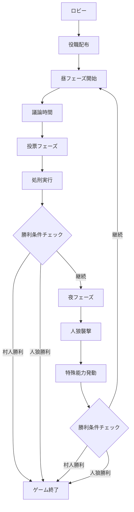

# Otak Jinro (人狼ゲーム)

Next.js + Cloudflare Workers を使用したリアルタイム人狼ゲーム

## 📋 目次

- [概要](#概要)
- [技術スタック](#技術スタック)
- [プロジェクト構造](#プロジェクト構造)
- [セットアップ](#セットアップ)
- [開発環境](#開発環境)
- [API仕様](#api仕様)
- [ゲーム仕様](#ゲーム仕様)
- [トラブルシューティング](#トラブルシューティング)
- [開発ログ](#開発ログ)

## 🎯 概要

Otak Jinroは、Cloudflare WorkersとNext.jsを使用して構築されたリアルタイムオンライン人狼ゲームです。WebSocketを使用したリアルタイム通信により、複数のプレイヤーが同時にゲームを楽しむことができます。

### 主な特徴

- ✅ **リアルタイムマルチプレイヤー**: WebSocketによる即座の状態同期
- ✅ **スケーラブル**: Cloudflare Workersのエッジコンピューティング
- ✅ **モダンUI**: Next.js 14 + Tailwind CSSによるレスポンシブデザイン
- ✅ **型安全**: TypeScriptによる堅牢な開発
- ✅ **モノレポ**: Turboによる効率的な開発環境

## 🛠️ 技術スタック

### Frontend
- **Next.js 14** (App Router)
- **TypeScript**
- **Tailwind CSS**
- **WebSocket API**

### Backend
- **Cloudflare Workers**
- **Durable Objects** (ゲーム状態管理)
- **Cloudflare KV** (プレイヤーデータ)
- **WebSocket API** (リアルタイム通信)

### 共通
- **TypeScript** (型定義共有)
- **Turbo** (モノレポ管理)

## 📁 プロジェクト構造

```
otak-jinro/
├── packages/
│   ├── shared/                    # 共通型定義・ユーティリティ
│   │   ├── src/
│   │   │   ├── types/game.ts      # ゲーム型定義
│   │   │   ├── utils/gameUtils.ts # ゲームロジック
│   │   │   └── index.ts           # エクスポート
│   │   ├── package.json
│   │   └── tsconfig.json
│   │
│   ├── workers/                   # Cloudflare Workers バックエンド
│   │   ├── src/
│   │   │   ├── gameRoom.ts        # Durable Object (ゲームルーム)
│   │   │   ├── index.ts           # メインWorker
│   │   │   ├── types.ts           # Worker型定義
│   │   │   └── utils.ts           # ユーティリティ
│   │   ├── package.json
│   │   ├── wrangler.toml          # Cloudflare設定
│   │   └── tsconfig.json
│   │
│   └── frontend/                  # Next.js フロントエンド
│       ├── src/
│       │   ├── app/
│       │   │   ├── layout.tsx     # レイアウト
│       │   │   ├── page.tsx       # ホームページ
│       │   │   ├── globals.css    # グローバルCSS
│       │   │   └── room/[roomId]/ # 動的ルーティング
│       │   │       └── page.tsx   # ルームページ
│       │   ├── components/ui/     # UIコンポーネント
│       │   │   ├── button.tsx
│       │   │   ├── card.tsx
│       │   │   ├── input.tsx
│       │   │   ├── label.tsx
│       │   │   └── tabs.tsx
│       │   └── lib/
│       │       └── utils.ts       # ユーティリティ
│       ├── public/
│       │   └── grid.svg           # 背景グリッド
│       ├── package.json
│       ├── next.config.js
│       ├── tailwind.config.js
│       ├── postcss.config.js
│       └── tsconfig.json
│
├── logs/                          # 開発ログ
│   ├── frontend.log
│   └── workers.log
│
├── start-dev.ps1                 # 開発環境起動スクリプト
├── watch-logs.ps1                # ログ監視スクリプト
├── test-api.ps1                  # API テストスクリプト
├── package.json                  # ルートパッケージ
├── turbo.json                    # Turbo設定
└── README.md                     # このファイル
```

## 🚀 セットアップ

### 前提条件

- Node.js 18+
- npm 9+
- PowerShell (Windows)

### インストール

1. **リポジトリクローン**
   ```bash
   git clone https://github.com/systemexe-research-and-development/jinro-game
   cd jinro-game/otak-jinro
   ```

2. **依存関係インストール**
   ```bash
   npm install
   ```

3. **開発環境起動**
   ```powershell
   powershell -ExecutionPolicy Bypass -File start-dev.ps1
   ```

### 🔄 開発スクリプトの使用順序

#### 1. 初回セットアップ
```powershell
# 1. 依存関係インストール
npm install

# 2. 開発環境起動（フロントエンド + Workers）
powershell -ExecutionPolicy Bypass -File start-dev.ps1
```

#### 2. 開発中の監視
```powershell
# 新しいターミナルでログ監視（推奨）
Get-Content -Path "logs\frontend.log" -Wait -Tail 10

# または専用スクリプト使用
powershell -ExecutionPolicy Bypass -File watch-logs.ps1 frontend
powershell -ExecutionPolicy Bypass -File watch-logs.ps1 workers
powershell -ExecutionPolicy Bypass -File watch-logs.ps1 all
```

#### 3. 動作確認・テスト
```powershell
# 基本動作確認
curl http://localhost:3000      # フロントエンド
curl http://localhost:8787/health  # Workers ヘルスチェック

# 包括的APIテスト
powershell -ExecutionPolicy Bypass -File test-api.ps1
```

### 📋 スクリプト詳細説明

#### `start-dev.ps1` - 開発環境起動
**目的**: フロントエンドとWorkersを同時起動し、ログファイルに出力

**実行内容**:
1. ログディレクトリ作成
2. 既存のNodeプロセス停止
3. フロントエンド起動（port 3000）
4. Workers起動（port 8787）
5. ログファイルへの出力設定

**使用タイミング**: 開発開始時

#### `watch-logs.ps1` - ログ監視
**目的**: リアルタイムでログを監視

**使用方法**:
```powershell
# フロントエンドログのみ
powershell -ExecutionPolicy Bypass -File watch-logs.ps1 frontend

# Workersログのみ
powershell -ExecutionPolicy Bypass -File watch-logs.ps1 workers

# 全ログ（デフォルト）
powershell -ExecutionPolicy Bypass -File watch-logs.ps1 all
```

**使用タイミング**: 開発中のデバッグ時

#### `test-api.ps1` - API テスト
**目的**: バックエンドAPIの動作確認

**テスト内容**:
1. ヘルスチェック（`/health`）
2. ルーム作成（`POST /api/rooms`）
3. ルーム情報取得（`GET /api/rooms/{id}`）
4. ルーム参加（`POST /api/rooms/{id}/join`）

**使用タイミング**: 機能実装後の確認時

### ⚡ 推奨開発フロー

#### 日常開発
```powershell
# 1. 開発環境起動
powershell -ExecutionPolicy Bypass -File start-dev.ps1

# 2. 新しいターミナルでログ監視
Get-Content -Path "logs\frontend.log" -Wait -Tail 10

# 3. ブラウザで確認
# http://localhost:3000

# 4. 機能実装後にテスト
powershell -ExecutionPolicy Bypass -File test-api.ps1
```

#### トラブルシューティング時
```powershell
# 1. 全ログ確認
Get-Content -Path "logs\*.log" -Wait -Tail 20

# 2. プロセス確認
Get-Process | Where-Object {$_.ProcessName -like "*node*"}

# 3. ポート確認
netstat -ano | findstr :3000
netstat -ano | findstr :8787

# 4. 強制再起動
taskkill /F /IM node.exe
powershell -ExecutionPolicy Bypass -File start-dev.ps1
```

## 🔧 開発環境

### サーバー起動

```powershell
# 開発環境一括起動
powershell -ExecutionPolicy Bypass -File start-dev.ps1

# 個別起動
cd packages/frontend && npm run dev    # フロントエンド (port 3000)
cd packages/workers && npx wrangler dev # Workers (port 8787)
```

### ログ監視

```powershell
# 全ログ監視
Get-Content -Path "logs\*.log" -Wait -Tail 20

# 個別ログ監視
Get-Content -Path "logs\frontend.log" -Wait -Tail 10  # フロントエンド
Get-Content -Path "logs\workers.log" -Wait -Tail 10   # Workers
```

### 動作確認

```powershell
# フロントエンド確認
curl http://localhost:3000

# Workers確認
curl http://localhost:8787/health

# API テスト
powershell -ExecutionPolicy Bypass -File test-api.ps1
```

## 📡 API仕様

### REST API

#### ヘルスチェック
```http
GET /health
```

#### ルーム作成
```http
POST /api/rooms
Content-Type: application/json

{
  "hostName": "プレイヤー名",
  "settings": {
    "maxPlayers": 12,
    "dayDuration": 300,
    "nightDuration": 120,
    "votingDuration": 60,
    "enableVoiceChat": false,
    "enableSpectators": true,
    "customRoles": []
  }
}
```

#### ルーム参加
```http
POST /api/rooms/{roomId}/join
Content-Type: application/json

{
  "playerName": "プレイヤー名"
}
```

#### ルーム情報取得
```http
GET /api/rooms/{roomId}
```

### WebSocket API

#### 接続
```
ws://localhost:8787/api/rooms/{roomId}/ws
```

#### メッセージ形式

**ルーム参加**
```json
{
  "type": "join_room",
  "roomId": "ABCDEF",
  "player": {
    "name": "プレイヤー名",
    "isReady": false
  }
}
```

**チャット送信**
```json
{
  "type": "chat",
  "roomId": "ABCDEF",
  "message": {
    "content": "メッセージ内容",
    "type": "public"
  }
}
```

**投票**
```json
{
  "type": "vote",
  "roomId": "ABCDEF",
  "vote": {
    "targetId": "プレイヤーID"
  }
}
```

## 🎮 ゲーム仕様

### 基本ルール

1. **ロビーフェーズ**: プレイヤーが集まり、ゲーム開始を待つ
2. **昼フェーズ**: 全員で議論し、怪しい人を投票で処刑
3. **夜フェーズ**: 人狼が村人を襲撃、特殊役職が能力発動
4. **勝利条件**:
   - 村人チーム: 人狼を全員処刑
   - 人狼チーム: 村人と同数以下になる

### 役職一覧

| 役職 | チーム | 能力 | 説明 |
|------|--------|------|------|
| 村人 | 村人 | なし | 人狼を見つけて処刑することが目標 |
| 人狼 | 人狼 | 襲撃 | 夜に村人を襲撃、昼は正体を隠す |
| 占い師 | 村人 | 占い | 毎晩一人を占って人狼かどうか判定 |
| 霊媒師 | 村人 | 霊媒 | 処刑された人が人狼だったか判定 |
| 狩人 | 村人 | 護衛 | 毎晩一人を人狼の襲撃から守る |
| 狂人 | 人狼 | なし | 人狼チームだが人狼が誰かは分からない |

### ゲームフロー



## 🐛 トラブルシューティング

### よくある問題

#### 1. サーバーが起動しない
```powershell
# プロセス確認
Get-Process | Where-Object {$_.ProcessName -like "*node*"}

# ポート確認
netstat -ano | findstr :3000
netstat -ano | findstr :8787

# 強制終了
taskkill /F /IM node.exe
```

#### 2. WebSocket接続エラー
- Workersサーバーが起動しているか確認
- ファイアウォール設定を確認
- ブラウザのコンソールでエラーログを確認

#### 3. TypeScriptエラー
```bash
# 型チェック
npm run type-check

# 依存関係再インストール
rm -rf node_modules package-lock.json
npm install
```

#### 4. Tailwind CSSが適用されない
```bash
# PostCSS設定確認
cd packages/frontend
npm run build
```

### ログレベル

- **INFO**: 通常の動作ログ
- **WARN**: 警告（動作に影響なし）
- **ERROR**: エラー（要対応）

## 📝 開発ログ

### 2025/05/23 - プロジェクト初期化

#### 実装内容
1. **プロジェクト構造作成**
   - モノレポ構成（Turbo使用）
   - 共通パッケージ（shared）
   - フロントエンド（Next.js）
   - バックエンド（Cloudflare Workers）

2. **共通パッケージ実装**
   - ゲーム型定義（GameState, Player, WebSocketMessage等）
   - ゲームロジック（役職配布、勝利条件判定、投票集計）
   - 定数・エラーメッセージ・役職情報

3. **バックエンド実装**
   - Durable Object によるゲームルーム管理
   - WebSocket リアルタイム通信
   - REST API エンドポイント
   - ルーム作成・参加・ゲーム進行ロジック

4. **フロントエンド実装**
   - Next.js 14 + App Router
   - Tailwind CSS + カスタムUIコンポーネント
   - ホームページ（ルーム作成・参加）
   - ルームページ（ゲーム画面）
   - WebSocket通信

#### 動作確認
- ✅ フロントエンド起動確認（localhost:3000）
- ✅ ルーム作成機能動作確認
- ✅ ページ遷移動作確認
- ✅ ログ出力システム構築

#### 技術的課題と解決
1. **workspace:* 構文エラー**
   - 解決: `file:../shared` 形式に変更

2. **Radix UI パッケージエラー**
   - 解決: 基本UIコンポーネントを自作

3. **tailwindcss-animate 依存関係エラー**
   - 解決: plugins配列を空に設定

4. **Next.js viewport メタデータ警告**
   - 解決: viewport を別エクスポートに分離

#### 次回実装予定
- [ ] Workersサーバー完全動作確認
- [ ] WebSocket通信テスト
- [ ] マルチプレイヤーテスト
- [ ] ゲームロジック詳細実装
- [ ] UI/UX改善

### パフォーマンス指標

#### ビルド時間
- **Frontend**: ~2.4秒（463モジュール）
- **Workers**: ~1.0秒（推定）

#### 応答時間
- **ホームページ**: 71ms（2回目以降）
- **API**: 未測定

#### リソース使用量
- **Node.js プロセス**: 14個実行中
- **メモリ使用量**: 平均50MB/プロセス

## 🤝 コントリビューション

1. フォークを作成
2. フィーチャーブランチを作成 (`git checkout -b feature/amazing-feature`)
3. 変更をコミット (`git commit -m 'Add some amazing feature'`)
4. ブランチにプッシュ (`git push origin feature/amazing-feature`)
5. プルリクエストを作成

## 📄 ライセンス

このプロジェクトは MIT ライセンスの下で公開されています。

## 👥 開発チーム

- **SystemExe Research and Development**

---

**最終更新**: 2025/05/23 19:54 JST