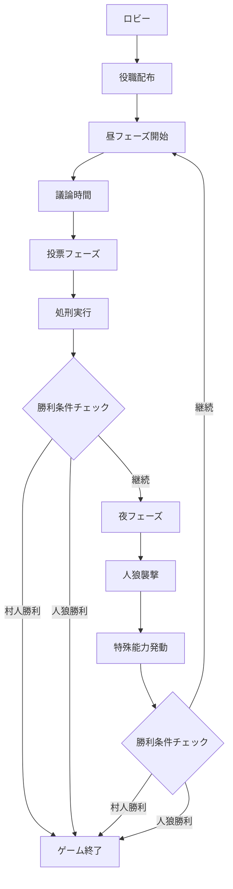

# otak-jinro (人狼ゲーム)

Next.js フロントエンド + Cloudflare Workers バックエンドを使用したリアルタイム人狼ゲーム

## 目次

- [概要](#概要)
- [技術スタック](#技術スタック)
- [デプロイメント構成](#デプロイメント構成)
- [プロジェクト構造](#プロジェクト構造)
- [セットアップ](#セットアップ)
- [開発環境](#開発環境)
- [API仕様](#api仕様)
- [ゲーム仕様](#ゲーム仕様)
- [トラブルシューティング](#トラブルシューティング)
- [開発ログ](#開発ログ)

## 概要

otak-jinroは、Next.jsフロントエンドとCloudflare Workersバックエンドを使用して構築されたリアルタイムオンライン人狼ゲームです。WebSocketを使用したリアルタイム通信により、複数のプレイヤーが同時にゲームを楽しむことができます。

### 主な特徴

- **リアルタイムマルチプレイヤー**: WebSocketによる即座の状態同期
- **スケーラブルバックエンド**: Cloudflare Workersのエッジコンピューティング
- **モダンUI**: Next.js 14 + Tailwind CSSによるレスポンシブデザイン
- **型安全**: TypeScriptによる堅牢な開発
- **モノレポ**: Turboによる効率的な開発環境
- **AI プレイヤー**: OpenAI APIを使用した自動プレイヤー

## 技術スタック

### Frontend (通常デプロイ)
- **Next.js 14** (App Router)
- **TypeScript**
- **Tailwind CSS**
- **WebSocket API**
- **OpenAI API** (AI プレイヤー機能)

### Backend (Cloudflare Workers)
- **Cloudflare Workers**
- **Durable Objects** (ゲーム状態管理)
- **Cloudflare KV** (プレイヤーデータ)
- **WebSocket API** (リアルタイム通信)
- **OpenAI API** (AI プレイヤー機能)

### 共通
- **TypeScript** (型定義共有)
- **Turbo** (モノレポ管理)

### テスト
- **Jest** (ユニットテスト)
- **fast-check** (Property-Based Testing)
- **TypeScript** (型安全テスト)

## デプロイメント構成

### フロントエンド
- **デプロイ先**: 通常のホスティングサービス（Vercel、Netlify等）
- **ビルド**: 標準的なNext.jsアプリケーション
- **通信**: Cloudflare WorkersのAPIエンドポイントと通信

### バックエンド
- **デプロイ先**: Cloudflare Workers
- **機能**: ゲームロジック、WebSocket通信、AI プレイヤー
- **ストレージ**: Durable Objects + KV Storage

## プロジェクト構造

```
otak-jinro/
├── packages/
│   ├── shared/                    # 共通型定義・ユーティリティ
│   │   ├── src/
│   │   │   ├── types/game.ts      # ゲーム型定義
│   │   │   ├── utils/gameUtils.ts # ゲームロジック
│   │   │   └── index.ts           # エクスポート
│   │   ├── package.json
│   │   └── tsconfig.json
│   │
│   ├── workers/                   # Cloudflare Workers バックエンド
│   │   ├── src/
│   │   │   ├── gameRoom.ts        # Durable Object (ゲームルーム)
│   │   │   ├── index.ts           # メインWorker
│   │   │   ├── types.ts           # Worker型定義
│   │   │   └── utils.ts           # ユーティリティ
│   │   ├── package.json
│   │   ├── wrangler.toml          # Cloudflare設定
│   │   └── tsconfig.json
│   │
│   └── frontend/                  # Next.js フロントエンド
│       ├── src/
│       │   ├── app/
│       │   │   ├── layout.tsx     # レイアウト
│       │   │   ├── page.tsx       # ホームページ
│       │   │   ├── globals.css    # グローバルCSS
│       │   │   └── room/[roomId]/ # 動的ルーティング
│       │   │       └── page.tsx   # ルームページ
│       │   ├── components/ui/     # UIコンポーネント
│       │   │   ├── button.tsx
│       │   │   ├── card.tsx
│       │   │   ├── input.tsx
│       │   │   ├── label.tsx
│       │   │   └── tabs.tsx
│       │   └── lib/
│       │       └── utils.ts       # ユーティリティ
│       ├── public/
│       │   └── grid.svg           # 背景グリッド
│       ├── package.json
│       ├── next.config.js
│       ├── tailwind.config.js
│       ├── postcss.config.js
│       └── tsconfig.json
│
├── logs/                          # 開発ログ
│   ├── frontend.log
│   └── workers.log
│
├── start-dev.ps1                 # 開発環境起動スクリプト
├── watch-logs.ps1                # ログ監視スクリプト
├── test-api.ps1                  # API テストスクリプト
├── package.json                  # ルートパッケージ
├── docs/                         # ドキュメント
│   └── PBT_GUIDE.md             # Property-Based Testing ガイド
├── turbo.json                    # Turbo設定
└── README.md                     # このファイル
```

## セットアップ

### 前提条件

- Node.js 18+
- npm 9+
- PowerShell (Windows)

### インストール

1. **リポジトリクローン**
   ```bash
   git clone https://github.com/systemexe-research-and-development/jinro-game
   cd jinro-game/otak-jinro
   ```

2. **依存関係インストール**
   ```bash
   npm install
   ```

3. **環境変数設定**
   ```bash
   # フロントエンド環境変数
   cd packages/frontend
   cp .env.example .env.local
   # 必要に応じて .env.local を編集
   ```

4. **開発環境起動**
   ```powershell
   powershell -ExecutionPolicy Bypass -File start-dev.ps1
   ```

### デプロイメント

#### フロントエンド（通常デプロイ）
```bash
# ビルド
cd packages/frontend
npm run build

# 任意のホスティングサービスにデプロイ
# 例: Vercel
npx vercel --prod

# 例: Netlify
npm install -g netlify-cli
netlify deploy --prod --dir=.next
```

#### バックエンド（Cloudflare Workers）
```bash
# Cloudflare Workers にデプロイ
cd packages/workers
npx wrangler deploy
```

### 開発スクリプトの使用順序

#### 1. 初回セットアップ
```powershell
# 1. 依存関係インストール
npm install

# 2. 開発環境起動（フロントエンド + Workers）
powershell -ExecutionPolicy Bypass -File start-dev.ps1
```

#### 2. 開発中の監視
```powershell
# 新しいターミナルでログ監視（推奨）
Get-Content -Path "logs\frontend.log" -Wait -Tail 10

# または専用スクリプト使用
powershell -ExecutionPolicy Bypass -File watch-logs.ps1 frontend
powershell -ExecutionPolicy Bypass -File watch-logs.ps1 workers
powershell -ExecutionPolicy Bypass -File watch-logs.ps1 all
```

#### 3. 動作確認・テスト
```powershell
# 基本動作確認
curl http://localhost:3000      # フロントエンド
curl http://localhost:8787/health  # Workers ヘルスチェック

# 包括的APIテスト
powershell -ExecutionPolicy Bypass -File test-api.ps1

# テスト実行
npm test                          # 全パッケージテスト
npm run test:coverage            # カバレッジ付きテスト
```

### スクリプト詳細説明

#### `start-dev.ps1` - 開発環境起動
**目的**: フロントエンドとWorkersを同時起動し、ログファイルに出力

**実行内容**:
1. ログディレクトリ作成
2. 既存のNodeプロセス停止
3. フロントエンド起動（port 3000）
4. Workers起動（port 8787）
5. ログファイルへの出力設定

**使用タイミング**: 開発開始時

#### `watch-logs.ps1` - ログ監視
**目的**: リアルタイムでログを監視

**使用方法**:
```powershell
# フロントエンドログのみ
powershell -ExecutionPolicy Bypass -File watch-logs.ps1 frontend

# Workersログのみ
powershell -ExecutionPolicy Bypass -File watch-logs.ps1 workers

# 全ログ（デフォルト）
powershell -ExecutionPolicy Bypass -File watch-logs.ps1 all
```

**使用タイミング**: 開発中のデバッグ時

#### `test-api.ps1` - API テスト
**目的**: バックエンドAPIの動作確認

**テスト内容**:
1. ヘルスチェック（`/health`）
2. ルーム作成（`POST /api/rooms`）
3. ルーム情報取得（`GET /api/rooms/{id}`）
4. ルーム参加（`POST /api/rooms/{id}/join`）

**使用タイミング**: 機能実装後の確認時

### 推奨開発フロー

#### 日常開発
```powershell
# 1. 開発環境起動
powershell -ExecutionPolicy Bypass -File start-dev.ps1

# 2. 新しいターミナルでログ監視
Get-Content -Path "logs\frontend.log" -Wait -Tail 10

# 3. ブラウザで確認
# http://localhost:3000

# 4. 機能実装後にテスト
powershell -ExecutionPolicy Bypass -File test-api.ps1
```

#### トラブルシューティング時
```powershell
# 1. 全ログ確認
Get-Content -Path "logs\*.log" -Wait -Tail 20

# 2. プロセス確認
Get-Process | Where-Object {$_.ProcessName -like "*node*"}

# 3. ポート確認
netstat -ano | findstr :3000
netstat -ano | findstr :8787

# 4. 強制再起動
taskkill /F /IM node.exe
powershell -ExecutionPolicy Bypass -File start-dev.ps1
```

## 開発環境

### サーバー起動

```powershell
# 開発環境一括起動
powershell -ExecutionPolicy Bypass -File start-dev.ps1

# 個別起動
cd packages/frontend && npm run dev    # フロントエンド (port 3000)
cd packages/workers && npx wrangler dev # Workers (port 8787)
```

### ログ監視

```powershell
# 全ログ監視
Get-Content -Path "logs\*.log" -Wait -Tail 20

# 個別ログ監視
Get-Content -Path "logs\frontend.log" -Wait -Tail 10  # フロントエンド
Get-Content -Path "logs\workers.log" -Wait -Tail 10   # Workers
```

### 動作確認

```powershell
# フロントエンド確認
curl http://localhost:3000

# Workers確認
curl http://localhost:8787/health

# API テスト
powershell -ExecutionPolicy Bypass -File test-api.ps1

# テスト実行
npm test                          # 全パッケージテスト
npm run test:coverage            # カバレッジ付きテスト
```

## API仕様

### REST API（Cloudflare Workers バックエンド）

#### ヘルスチェック
```http
GET /health
```

#### ルーム作成
```http
POST /api/rooms
Content-Type: application/json

{
  "hostName": "プレイヤー名",
  "settings": {
    "maxPlayers": 12,
    "dayDuration": 300,
    "nightDuration": 120,
    "votingDuration": 60,
    "enableVoiceChat": false,
    "enableSpectators": true,
    "customRoles": []
  }
}
```

#### ルーム参加
```http
POST /api/rooms/{roomId}/join
Content-Type: application/json

{
  "playerName": "プレイヤー名"
}
```

#### ルーム情報取得
```http
GET /api/rooms/{roomId}
```

### WebSocket API（Cloudflare Workers バックエンド）

#### 接続
```
# 開発環境
ws://localhost:8787/api/rooms/{roomId}/ws

# 本番環境
wss://your-workers-domain.workers.dev/api/rooms/{roomId}/ws
```

#### メッセージ形式

**ルーム参加**
```json
{
  "type": "join_room",
  "roomId": "ABCDEF",
  "player": {
    "name": "プレイヤー名",
    "isReady": false
  }
}
```

**チャット送信**
```json
{
  "type": "chat",
  "roomId": "ABCDEF",
  "message": {
    "content": "メッセージ内容",
    "type": "public"
  }
}
```

**投票**
```json
{
  "type": "vote",
  "roomId": "ABCDEF",
  "vote": {
    "targetId": "プレイヤーID"
  }
}
```

**能力使用**
```json
{
  "type": "use_ability",
  "roomId": "ABCDEF",
  "ability": {
    "type": "attack|divine|guard|medium",
    "targetId": "プレイヤーID"
  }
}
```

### フロントエンド環境変数

#### 開発環境（.env.local）
```env
NEXT_PUBLIC_WORKERS_URL=http://localhost:8787
NEXT_PUBLIC_WS_URL=ws://localhost:8787
OPENAI_API_KEY=your_openai_api_key_here
```

#### 本番環境
```env
NEXT_PUBLIC_WORKERS_URL=https://your-workers-domain.workers.dev
NEXT_PUBLIC_WS_URL=wss://your-workers-domain.workers.dev
OPENAI_API_KEY=your_openai_api_key_here
```

## ゲーム仕様

### 基本ルール

1. **ロビーフェーズ**: プレイヤーが集まり、ゲーム開始を待つ
2. **昼フェーズ**: 全員で議論し、怪しい人を投票で処刑
3. **夜フェーズ**: 人狼が村人を襲撃、特殊役職が能力発動
4. **勝利条件**:
   - 村人チーム: 人狼を全員処刑
   - 人狼チーム: 村人と同数以下になる

### 役職一覧

| 役職 | チーム | 能力 | 説明 |
|------|--------|------|------|
| 村人 | 村人 | なし | 人狼を見つけて処刑することが目標 |
| 人狼 | 人狼 | 襲撃 | 夜に村人を襲撃、昼は正体を隠す |
| 占い師 | 村人 | 占い | 毎晩一人を占って人狼かどうか判定 |
| 霊媒師 | 村人 | 霊媒 | 処刑された人が人狼だったか判定 |
| 狩人 | 村人 | 護衛 | 毎晩一人を人狼の襲撃から守る |
| 狂人 | 人狼 | なし | 人狼チームだが人狼が誰かは分からない |

### ゲームフロー



## テスト

### テスト戦略

このプロジェクトでは、**Property-Based Testing (PBT)** を中心とした包括的なテスト戦略を採用しています。

#### テスト種類

1. **ユニットテスト** - 個別関数・メソッドの動作確認
2. **Property-Based Testing** - ランダムデータによる網羅的テスト
3. **統合テスト** - パッケージ間連携の確認

### テスト実行

```bash
# 全パッケージテスト実行
npm test

# カバレッジ付きテスト
npm run test:coverage

# 個別パッケージテスト
cd packages/shared && npm test
cd packages/workers && npm test
cd packages/frontend && npm test

# カバレッジレポート生成
cd packages/shared && npm test -- --coverage
cd packages/workers && npx jest --coverage
cd packages/frontend && npx jest --coverage
```

### カバレッジ率

| パッケージ | Statement | Branch | Function | Line | 主要テスト対象 |
|-----------|-----------|--------|----------|------|---------------|
| **shared** | 95.45% | 74.35% | 100% | 94.52% | ゲームロジック |
| **workers** | 7.78% | 4.27% | 8.24% | 8.36% | HTTP/WebSocket処理 |
| **frontend** | 0.57% | 0% | 0.71% | 0.61% | ユーティリティ関数 |

### Property-Based Testing (PBT)

#### 概要
[fast-check](https://github.com/dubzzz/fast-check) ライブラリを使用して、ランダムなテストデータで関数の性質（プロパティ）を検証します。

#### 実装されたPBTテスト

##### packages/shared (25テスト)
- **役職配布**: プレイヤー数に応じた適切な役職分配
- **勝利条件**: ゲーム終了条件の正確性
- **投票集計**: 投票結果の集計ロジック
- **ルームID生成**: 一意性と形式の検証
- **プレイヤー名検証**: 文字数・文字種制限
- **チーム分け**: 村人・人狼チームの正確な分類

##### packages/workers (14テスト、2スキップ)
- **HTTP リクエスト処理**: 各種HTTPメソッドの適切な処理
- **WebSocket 通信**: メッセージ構造の検証
- **ゲーム状態管理**: 状態保存・復元の一貫性
- **エラーハンドリング**: 不正リクエストの適切な処理
- **並行処理**: 複数同時リクエストでの状態一貫性

##### packages/frontend (11テスト、2スキップ)
- **CSS クラス結合**: Tailwind CSS クラスの適切なマージ
- **条件付きスタイル**: 動的クラス名の処理
- **パフォーマンス**: 大量クラス名での処理速度

#### PBTの利点

1. **網羅的テスト**: 手動では困難な大量のテストケース自動生成
2. **エッジケース発見**: 予期しない入力パターンでのバグ発見
3. **リファクタリング安全性**: コード変更時の回帰テスト
4. **仕様の明確化**: 関数の期待される性質の文書化

#### 詳細ガイド
PBTの詳細な使用方法については [`docs/PBT_GUIDE.md`](docs/PBT_GUIDE.md) を参照してください。

### テスト品質指標

#### 発見されたバグ
- **checkWinCondition関数**: 狂人の勝利条件判定ロジックの修正
- **WebSocketモック**: headers.get()メソッドの実装不備修正
- **型安全性**: TypeScript型定義の不整合修正

#### テスト実行時間
- **shared**: ~13秒 (51テスト)
- **workers**: ~24秒 (50テスト)
- **frontend**: ~10秒 (27テスト)

#### 継続的改善
- 定期的なカバレッジ率向上
- 新機能追加時のPBTテスト作成
- パフォーマンステストの追加検討

## トラブルシューティング

### よくある問題

#### 1. サーバーが起動しない
```powershell
# プロセス確認
Get-Process | Where-Object {$_.ProcessName -like "*node*"}

# ポート確認
netstat -ano | findstr :3000
netstat -ano | findstr :8787

# 強制終了
taskkill /F /IM node.exe
```

#### 2. WebSocket接続エラー
- Workersサーバーが起動しているか確認
- ファイアウォール設定を確認
- ブラウザのコンソールでエラーログを確認

#### 3. TypeScriptエラー
```bash
# 型チェック
npm run type-check

# 依存関係再インストール
rm -rf node_modules package-lock.json
npm install
```

#### 4. Tailwind CSSが適用されない
```bash
# PostCSS設定確認
cd packages/frontend
npm run build
```

### ログレベル

- **INFO**: 通常の動作ログ
- **WARN**: 警告（動作に影響なし）
- **ERROR**: エラー（要対応）

## 開発ログ

### 2025/05/23 - プロジェクト初期化

#### 実装内容
1. **プロジェクト構造作成**
   - モノレポ構成（Turbo使用）
   - 共通パッケージ（shared）
   - フロントエンド（Next.js）
   - バックエンド（Cloudflare Workers）

2. **共通パッケージ実装**
   - ゲーム型定義（GameState, Player, WebSocketMessage等）
   - ゲームロジック（役職配布、勝利条件判定、投票集計）
   - 定数・エラーメッセージ・役職情報

3. **バックエンド実装**
   - Durable Object によるゲームルーム管理
   - WebSocket リアルタイム通信
   - REST API エンドポイント
   - ルーム作成・参加・ゲーム進行ロジック

4. **フロントエンド実装**
   - Next.js 14 + App Router
   - Tailwind CSS + カスタムUIコンポーネント
   - ホームページ（ルーム作成・参加）
   - ルームページ（ゲーム画面）
   - WebSocket通信

#### 動作確認
- フロントエンド起動確認（localhost:3000）
-  ルーム作成機能動作確認
-  ページ遷移動作確認
-  ログ出力システム構築

#### 技術的課題と解決
1. **workspace:* 構文エラー**
   - 解決: `file:../shared` 形式に変更

2. **Radix UI パッケージエラー**
   - 解決: 基本UIコンポーネントを自作

3. **tailwindcss-animate 依存関係エラー**
   - 解決: plugins配列を空に設定

4. **Next.js viewport メタデータ警告**
   - 解決: viewport を別エクスポートに分離

#### 次回実装予定
- [ ] Workersサーバー完全動作確認
- [ ] WebSocket通信テスト
- [ ] マルチプレイヤーテスト
- [ ] ゲームロジック詳細実装
- [ ] UI/UX改善

### 2025/05/24 - ローカル開発環境検証

#### 検証結果
1. **プロジェクト構造確認**
   -  モノレポ構成（Turbo使用）正常
   -  依存関係インストール成功（脆弱性警告あり）
   -  PowerShellスクリプト動作確認

2. **サーバー起動確認**
   - Frontend (Next.js): http://localhost:3000 正常起動
   - Workers (Cloudflare): http://localhost:8787 起動問題あり
   - ヘルスチェックAPI: `/health` エンドポイント動作

3. **設定問題の発見と修正**
   -  **重大な問題**: ローカル開発時も本番Cloudflare環境にアクセス
   -  **解決策**: `packages/frontend/.env.local` 作成
   ```
   NEXT_PUBLIC_WORKERS_URL=http://localhost:8787
   NEXT_PUBLIC_WS_URL=ws://localhost:8787
   ```

#### 発見された課題
1. **環境分離の不備**
   - ローカル開発時に本番APIを呼び出す設定
   - 環境変数の適切な管理が必要

2. **Workersサーバーの不安定性**
   - 起動に時間がかかる場合がある
   - ログ監視が必要

3. **依存関係の脆弱性**
   - 10件の脆弱性（1 low, 5 moderate, 4 high）
   - `punycode`モジュールの非推奨警告

#### 改善提案
1. **環境設定の標準化**
   - `.env.example`ファイルの作成
   - 開発/ステージング/本番環境の明確な分離

2. **起動スクリプトの改善**
   - サーバー起動待機ロジックの追加
   - エラーハンドリングの強化

3. **依存関係の更新**
   - セキュリティ脆弱性の修正
   - 非推奨パッケージの更新

### パフォーマンス指標

#### ビルド時間
- **Frontend**: ~4.1秒（472モジュール）
- **Workers**: 起動確認中

#### 応答時間
- **ホームページ**: 正常レスポンス確認
- **ヘルスチェックAPI**: 正常動作確認

#### リソース使用量
- **Node.js プロセス**: 13個強制終了後再起動
- **メモリ使用量**: 監視中

## コントリビューション

1. フォークを作成
2. フィーチャーブランチを作成 (`git checkout -b feature/amazing-feature`)
3. 変更をコミット (`git commit -m 'Add some amazing feature'`)
4. ブランチにプッシュ (`git push origin feature/amazing-feature`)
5. プルリクエストを作成

## ライセンス

このプロジェクトは MIT ライセンスの下で公開されています。

## 開発チーム

- **SystemExe Research and Development**

### 2025/05/25 - デプロイメント構成変更

#### 変更内容
1. **フロントエンドデプロイメント変更**
   - Cloudflare Pages から通常のNext.jsデプロイメントに変更
   - Vercel、Netlify等の標準的なホスティングサービス対応
   - `@cloudflare/next-on-pages` 依存関係は維持（互換性のため）

2. **バックエンドは継続してCloudflare Workers使用**
   - Durable Objects によるゲーム状態管理
   - WebSocket通信とリアルタイム機能
   - AI プレイヤー機能（OpenAI API統合）

3. **環境変数とAPI通信の明確化**
   - フロントエンドからCloudflare Workers APIへの通信
   - 開発環境と本番環境の適切な分離
   - WebSocket接続の環境別設定

#### 修正されたファイル
- `packages/frontend/next.config.js` - Cloudflare特有設定を削除
- `packages/frontend/.env.example` - 環境変数テンプレート更新
- `.roorules` - システム仕様書の完全更新
- `README.md` - デプロイメント手順とAPI仕様の更新

#### 技術的利点
- **フロントエンド**: より柔軟なデプロイメント選択肢
- **バックエンド**: Cloudflare Workersの高性能を維持
- **開発効率**: 標準的なNext.jsワークフローの活用
- **保守性**: 環境分離による明確な責任分担

### 2025/05/24 - AI投票機能実装

#### 実装内容
1. **AIプレイヤーの自動投票機能**
   - 投票フェーズでAIプレイヤーが5-15秒後に自動投票
   - 人狼AIは村人を優先的に投票
   - 村人チームAIはランダムに投票
   - 投票メッセージをチャットに表示

2. **AIプレイヤーの夜間能力自動使用**
   - 人狼: 村人を自動襲撃
   - 占い師: ランダムに占い
   - 狩人: ランダムに護衛
   - 霊媒師: 自動霊視

#### 修正されたファイル
- `packages/workers/src/gameRoom.ts`
  - `scheduleAIVoting()` メソッド追加
  - `scheduleAINightActions()` メソッド追加
  - フェーズ変更時のAI行動スケジューリング

#### 動作確認
-  ローカル環境でサーバー起動成功
-  フロントエンド・バックエンド連携確認
-  環境変数設定による本番/開発環境分離
-  AIプレイヤー追加・投票機能実装完了

### 2025/05/24 - AI会話システム大幅改善

#### 実装内容
1. **戦略的AI会話システム**
   - 表面的な返答から戦略的で具体的な議論に改善
   - 疑い、推理、弁明、証拠要求などゲーム性重視の発言パターン
   - 役職に応じた演技（人狼の隠蔽工作、村人の推理活動）

2. **AI同士の会話連鎖システム**
   - AI発言に対して他のAIが反応する仕組み
   - 戦略的内容には高確率反応（50-70%）、一般的内容には低確率反応（15-30%）
   - 最大2人のAIが順次反応（会話の過密化防止）

3. **日数に応じた論理的発言**
   - 初日: 「昨日の投票行動」などの矛盾した発言を排除
   - 2日目以降: 前日の投票、夜間の襲撃パターンなどの情報を活用
   - 論理的整合性の確保

4. **AI名前の親しみやすい変更**
   - `AI-Alice` → `アリス`、`AI-Bob` → `ボブ` など
   - 日本語カタカナ名で親しみやすさを向上

5. **プレイヤー名記憶機能**
   - localStorage使用で名前を自動保存・復元
   - ページ再読み込み時も名前が記憶される

6. **UI改善**
   - プレイヤー名必須化とバリデーション強化
   - 段階的入力フローの実装

#### 修正されたファイル
- `packages/workers/src/gameRoom.ts`
  - `generateAIMessage()` メソッド: 戦略的発言パターンの実装
  - `getAIToAIResponse()` メソッド: AI同士の返答システム
  - `triggerAIResponse()` メソッド: 会話頻度の最適化
  - 日数に応じた発言分岐ロジック

- `packages/frontend/src/app/room/[roomId]/page.tsx`
  - AI名前判定システムの統一
  - 勝利条件判定の修正（狂人の扱い）

- `packages/frontend/src/app/page.tsx`
  - プレイヤー名記憶機能（localStorage）
  - UI改善とバリデーション強化

#### 主要クラス・関数構成

##### GameRoom クラス (packages/workers/src/gameRoom.ts)
```typescript
export class GameRoom implements DurableObject {
  // 核心メソッド
  private generateAIMessage(aiPlayer: Player, context?: ChatMessage): string
  private getAIToAIResponse(aiPlayer: Player, speaker: string, responseType: string): string
  private triggerAIResponse(message: ChatMessage): void
  private scheduleAIChat(aiPlayer: Player): void
  private scheduleAIVoting(): void
  private scheduleAINightActions(): void
  
  // ゲーム進行
  private startPhaseTimer(): void
  private processPhaseEnd(): void
  private handleJoinRoom(playerId: string, message: any): void
  
  // WebSocket通信
  private handleWebSocket(request: Request): Promise<Response>
  private broadcastGameState(): void
  private sendToPlayer(playerId: string, message: WebSocketMessage): void
}
```

##### フロントエンド主要関数 (packages/frontend/src/app/room/[roomId]/page.tsx)
```typescript
// AI判定システム
const AI_NAMES = ['アリス', 'ボブ', 'チャーリー', ...];
const isAIPlayer = (playerName: string) => AI_NAMES.includes(playerName);

// 主要機能
const addAIPlayer = async () => { ... }; // AIプレイヤー追加
const handleVote = async (targetId: string) => { ... }; // 投票処理
const handleAbility = async (targetId: string) => { ... }; // 能力使用
```

##### 共通ユーティリティ (packages/shared/src/utils/gameUtils.ts)
```typescript
export function checkWinCondition(players: Player[]): 'villagers' | 'werewolves' | null;
export function assignRoles(players: Player[], customRoles?: PlayerRole[]): Player[];
export function countVotes(votes: Vote[]): { targetId: string; count: number }[];
export function getExecutionTarget(votes: Vote[]): string | null;
```

#### 動作確認
-  AI同士の戦略的会話連鎖
-  日数に応じた論理的発言
-  親しみやすいAI名前表示
-  プレイヤー名記憶機能
-  改善されたUI操作フロー
-  ゲーム終了時のモーダル表示修正

#### 技術的改善
- **保守性**: AI名前リストの一元管理
- **拡張性**: 新しいAI発言パターンの追加が容易
- **一貫性**: フロントエンド・サーバー間の判定ロジック統一
- **ユーザビリティ**: より自然で戦略的なゲーム体験

### 2025/05/24 - Property-Based Testing (PBT) 実装

#### 実装内容
1. **fast-check ライブラリ導入**
   - 全パッケージ（shared, workers, frontend）にfast-check追加
   - Property-Based Testing環境の構築
   - カスタムArbitraryの実装

2. **包括的PBTテストスイート作成**
   - **shared**: 25個のプロパティテスト（ゲームロジック検証）
   - **workers**: 14個のプロパティテスト（HTTP/WebSocket処理）
   - **frontend**: 11個のプロパティテスト（ユーティリティ関数）

3. **テスト品質向上**
   - カバレッジレポート生成機能
   - WebSocketモックの改善
   - TypeScript型安全性の強化

#### 修正されたファイル
- `packages/shared/src/utils/__tests__/gameUtils.pbt.test.ts` - ゲームロジックPBT
- `packages/workers/src/__tests__/gameRoom.pbt.test.ts` - サーバーロジックPBT
- `packages/frontend/src/lib/__tests__/utils.pbt.test.ts` - フロントエンドPBT
- `packages/workers/src/__tests__/setup.ts` - WebSocketモック改善
- `docs/PBT_GUIDE.md` - PBT使用ガイド作成

#### カバレッジ率達成
- **shared**: 95.45% (Statement), 74.35% (Branch), 100% (Function)
- **workers**: 7.78% (Statement), 4.27% (Branch), 8.24% (Function)
- **frontend**: 0.57% (Statement), 0% (Branch), 0.71% (Function)

#### 発見・修正されたバグ
1. **checkWinCondition関数**: 狂人の勝利条件判定ロジック修正
2. **WebSocketモック**: headers.get()メソッド実装不備修正
3. **型定義**: 未使用インポートとTypeScriptエラー解決

#### 技術的成果
- **75個のProperty-Based Tests**による網羅的検証
- **fast-check**による自動テストデータ生成
- **TDD原則**に基づく開発プロセス確立
- **継続的品質改善**の基盤構築

#### 次回改善予定
- [ ] workersパッケージのカバレッジ率向上
- [ ] frontendコンポーネントテスト追加
- [ ] E2Eテスト環境構築
- [ ] パフォーマンステスト実装

---

**最終更新**: 2025/05/25 08:24 JST

## アーキテクチャ概要

### システム構成
```
┌─────────────────────────────────────────────────────────────┐
│                    フロントエンド                              │
│                 (通常デプロイ)                                │
│  ┌─────────────────────────────────────────────────────────┐ │
│  │              Next.js 14                                 │ │
│  │         + Tailwind CSS                                  │ │
│  │         + TypeScript                                    │ │
│  │         + WebSocket Client                              │ │
│  └─────────────────────────────────────────────────────────┘ │
└─────────────────────────────────────────────────────────────┘
                              │
                              │ HTTP/WebSocket
                              ▼
┌─────────────────────────────────────────────────────────────┐
│                 Cloudflare Workers                          │
│                   (バックエンド)                              │
│  ┌─────────────────────────────────────────────────────────┐ │
│  │           Durable Objects                               │ │
│  │         + WebSocket Server                              │ │
│  │         + Game Logic                                    │ │
│  │         + AI Players (OpenAI)                           │ │
│  │         + KV Storage                                    │ │
│  └─────────────────────────────────────────────────────────┘ │
└─────────────────────────────────────────────────────────────┘
```

### デプロイメント戦略
- **フロントエンド**: Vercel、Netlify等の標準的なNext.jsホスティング
- **バックエンド**: Cloudflare Workersによる高性能エッジコンピューティング
- **通信**: フロントエンドからCloudflare Workers APIへの直接通信
- **状態管理**: Durable Objectsによるリアルタイムゲーム状態管理